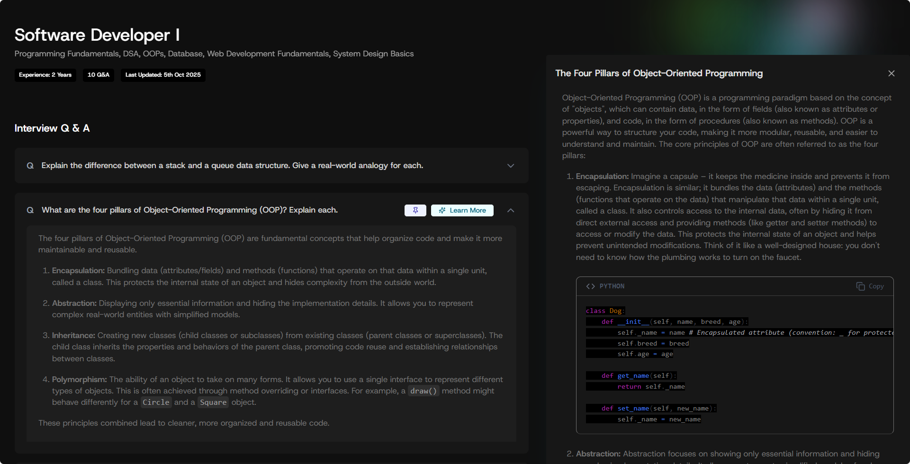

# PrepGrid‑AI



An AI-powered interview preparation app that helps you generate tailored interview questions, review sessions, and get clear explanations for concepts.

## Features

- Generate interview questions and answers using Google Gemini
- Create and manage prep sessions; pin questions and add notes
- Auth (register, login, profile) with JWT
- Upload and serve profile images
- Clean, modern React UI with Tailwind CSS

## Tech Stack

- **Frontend**: React 18, Vite, React Router, Tailwind CSS, Axios
- **Backend**: Node.js, Express 5, Mongoose , JWT, Multer, CORS, dotenv
- **AI**: `@google/genai` (Gemini 2.0)
- **Build/Dev**: Vite, Nodemon, Concurrently
- **Deploy**: Vercel (frontend) + any Node host for backend (can be Vercel, Render, Railway, etc.)

## Monorepo Layout

```
.
├─ backend/           # Express API
├─ frontend/          # React app (Vite)
├─ package.json       # Root convenience scripts
└─ README.md
```

## Prerequisites

- Node.js 18+
- A MongoDB database (Atlas or local)
- Google AI Studio API key (Gemini)

## Environment Variables

Create a `.env` file inside `backend/` with:

```
PORT=5000
MONGO_URI=YOUR_MONGODB_CONNECTION_STRING
JWT_SECRET=YOUR_LONG_RANDOM_SECRET
GEMINI_API_KEY=YOUR_GOOGLE_AI_STUDIO_API_KEY
```

Create a `.env` (or `.env.local`) inside `frontend/` with:

```
VITE_BASE_URL=https://your-backend-host.tld
```

- In development, you can use `http://localhost:5000` if you run the backend locally
- In production, set this to your deployed backend base URL

## Install

From the repo root:

```bash
npm run install-all
```

This installs dependencies in both `backend/` and `frontend/`.

## Development

Run backend and frontend concurrently from the root:

```bash
npm run dev
```

- Backend: `http://localhost:5000`
- Frontend: `http://localhost:5173`

CORS is preconfigured to allow `http://localhost:5173`.

## Backend

- Entry: `backend/server.js`
- CORS: allows `https://prepgrid.vercel.app` and `http://localhost:5173`
- Static: serves uploaded files at `/uploads`
- Routes (all JSON unless noted):
  - `POST /api/auth/register`
  - `POST /api/auth/login`
  - `GET  /api/auth/profile` (Bearer token)
  - `POST /api/auth/upload-image` (multipart/form-data, field `image`)
  - `POST /api/ai/generate-questions` (Bearer token)
  - `POST /api/ai/generate-explanation` (Bearer token)
  - `POST /api/sessions/create` (Bearer token)
  - `GET  /api/sessions/my-sessions` (Bearer token)
  - `GET  /api/sessions/:id` (Bearer token)
  - `DELETE /api/sessions/:id` (Bearer token)
  - `POST /api/questions/add` (Bearer token)
  - `POST /api/questions/:id/note` (Bearer token)
  - `GET  /api/questions/:id/pin` (Bearer token)

AI controllers expect Gemini to return JSON. The code strips code fences and parses JSON; ensure prompts and model outputs stay compatible.

## Frontend

- Entry: `frontend/src/main.jsx`, app routes in `frontend/src/App.jsx`:
  - `/` landing
  - `/dashboard`
  - `/prep-grid/:sessionId`
- HTTP client configured in `frontend/src/utils/axiosInstance.js` using `VITE_BASE_URL`
- SPA routing handled by React Router; for production hosting, ensure SPA rewrites to `index.html` (see Deployment)

Scripts (from `frontend/`):

```bash
npm run dev       # start Vite dev server
npm run build     # build to dist/
npm run preview   # preview build
```

## Images/Uploads

- Upload via `POST /api/auth/upload-image` with `multipart/form-data` field `image`
- Server responds with `{ imageUrl }`
- Files are stored under `backend/uploads/` and served at `/uploads/...`

## Root Scripts

From repo root `package.json`:

```bash
npm run install-all   # install backend and frontend deps
npm run dev           # run both servers concurrently
npm run build         # build frontend only (dist/)
npm run start         # start backend only
```

## Deployment

### Frontend (Vercel)

Recommended setup:

- In Vercel Project Settings, set Root Directory to `frontend`
- Build Command: `npm run build`
- Output Directory: `dist`
- Add `frontend/vercel.json` to enable SPA rewrites:

```json
{
  "rewrites": [{ "source": "/(.*)", "destination": "/index.html" }]
}
```


### Backend (Vercel/Render/Railway/Other)

- Provide environment variables from the Backend section
- Expose the server (`backend/server.js`) as the entry
- Ensure CORS allows your production frontend origin
- Set the frontend `VITE_BASE_URL` to this backend origin

## Security Notes

- Keep `JWT_SECRET` long and random
- Never commit `.env` files
- Validate/limit image uploads in production
